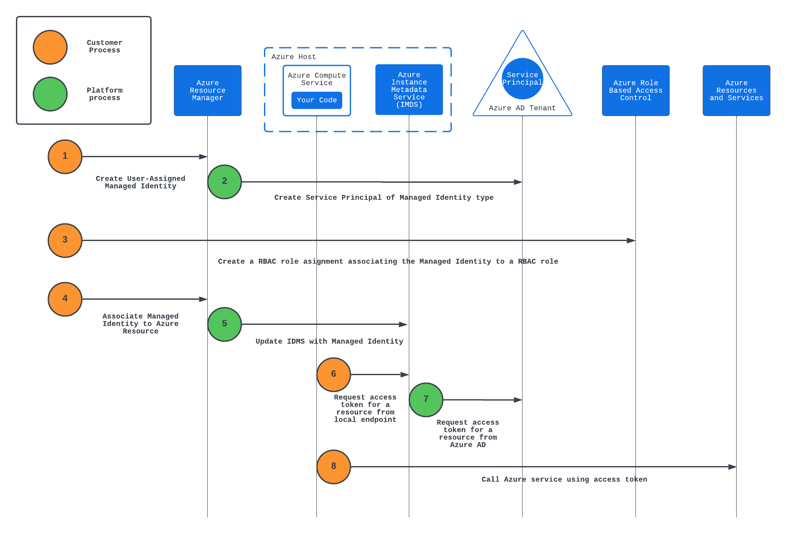
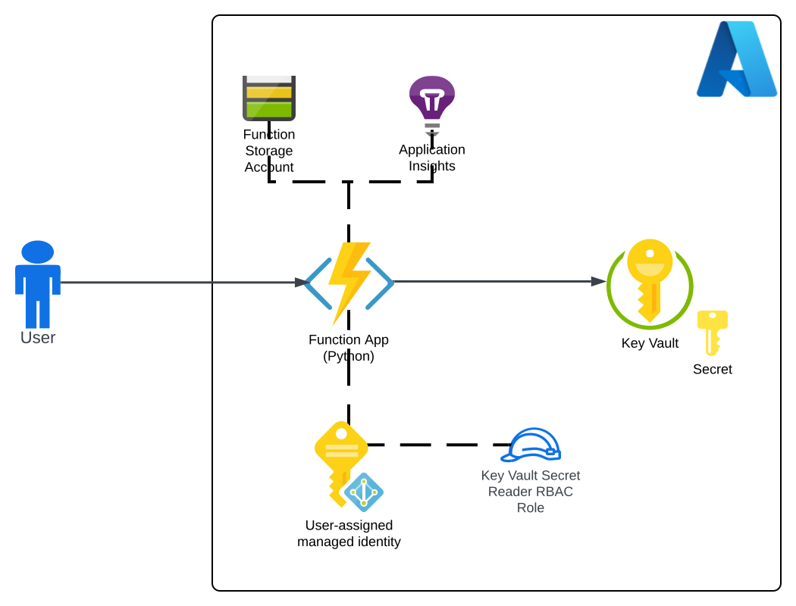

# Managed Identity Demo

## Overview
[Managed Identities](https://docs.microsoft.com/en-us/azure/active-directory/managed-identities-azure-resources/overview) ease the burden of managing the credentials for the identities used by application components to authenticate Azure services and each other. These applications can be running in Azure or running in [on-premises or another cloud](https://docs.microsoft.com/en-us/azure/azure-arc/servers/managed-identity-authentication). Managed Identities come in two forms, [system-assigned and user-assigned](https://docs.microsoft.com/en-us/azure/azure-arc/servers/managed-identity-authentication). This demonstration focuses on user-assigned managed identities because this type of managed identity betters aligns with the way organizations handle their identity and access management processes.

The image below illustrates how a user-assigned managed identity is created and used.

This repository includes a code in the form of ARM templates and Azure CLI commands to walk you through how to create and use a managed identity. This demo takes the "learn by doing" approach where a concept will be explained and then you will exercise on the concept.

The end state architecture of this demo is pictured below.

## Prerequisites

1. This demo will require you have sufficient permissions on the subscription to deploy resource groups, resources, and [create RBAC Roles and RBAC assignments](https://docs.microsoft.com/en-us/azure/role-based-access-control/overview). It is recommended you do this on a non-production subscription where you hold the Owner role at the subscription level.

2. You must have the az CLI commands installed and configured.

## Lab Setup

Before you begin the exercises, the lab environment must be deployed. The ARM templates within this repository will deploy an Azure Function, Azure Storage Account for the Function, an Azure Key Vault, and a secret within the Azure Key Vault.

Deploy the lab environment by using the Deploy to Azure button below. Note that you must first create the resource group.

## Excercises

### Exercise 1

In this exercise you will validate that Function App deployed correctely.

### Exercise 1

In the first exercise you will create a user-assigned management identity (UMI). You will view the properties of the UMI and find its service principal in Azure Active Directory.

1. Login to the the az CLI.

    **az login**

2. Set az CLI to use the appropriate subscription. Enter the name of your subscription into the subscription_name placeholder.

    **az account set --subscription subscription_name**

3. There are some variables that will be used throughout the demo. Create a variable for your resource group name. Enter the name of the resource group you created in the placeholder of my-resource-group.

    **RESOURCE_GROUP_NAME=my-resource-group-name**

4. Create the user-assigned managed identity and name it demo-umi. Enter the name of the region you want to deploy the resources into the myregion placeholder. This should be deployed to the same region you deployed the rest of the resources to.

    **az identity create --name demo-umi --location myregion --resource-group $RESOURCE_GROUP_NAME**

    Take a moment and examine the properties returned. The clientId property maps to the appId attribute of the UMI's service principal in Azure AD. The principalId maps to the objectId of the UMI's service principal in Azure AD.

5. You will now look at the service principal for your managed identity. The most efficient way to locate the service principal in Azure AD is to search using the objectId. Recall that the principalId of the UMI maps to the objectId in Azure AD.

    Store the principalId property in a variable.

    **UMI_OBJECT_ID=$(az identity show --name=demo-umi --resource-group $RESOURCE_GROUP_NAME --query=principalId --output=tsv)**

6. Query Azure AD for the UMI's service principal.

    **az ad sp show --id=$UMI_OBJECT_ID**

    Review the attributes of the service principal. Notice that the servicePrincipalType is ManagedIdentity.

### Exercise 2

In this exercise you will create a custom RBAC role that allows for getting secrets from Azure Key Vault. You will then create a role assignment associating the custom role with the UMI and setting the scope as the resource group.

In the artifacts folder of this repository you will find a file named kv-secrets-reader.json which includes a custom RBAC role that will allow the function to retrieve the value of the secret stored in Key Vault. You will need to modify the assignable scopes of this file and subscription YOURSUBSCRIPTIONID for the id of the subscription you deployed the resources into.

1. Retrieve the subscription id of your subscription.

    **az account show --query id --output=tsv**

2. Modify the kv-secrets-reader.json file in the artifacts folder by replacing the YOURSUBSCRIPTIONID in the AssignableScopes section with the subscription id retrieved from last step.

3. Create the new custom role. Substitute the RELATIVE_PATH_TO_FILE with the path to the kv-secrets-reader.json file you modified.

    **az role definition create --role-definition RELATIVE_PATH_TO_FILE**

    For example:

    **az role definition create --role-definition artifacts/kv-secrets-reader.json**

4. Before you can create the role assignment you will need the id of the resource group you created.

    Create a variable with the resource group id. Substitute RESOURCE_GROUP_NAME with the resource group you deployed the resources to.

    **RG_ID=$(az group show --name $RESOURCE_GROUP_NAME --query id --output=tsv)**

5. Create the role assignment at the resource group scope.

**az role assignment create --assignee-object-id $UMI_OBJECT_ID --role "Custom - Key Vault Secrets Reader" --scope $RG_ID**

### Exercise 3
You have now created an UMI, a custom RBAC role, and an assignment associating the role to the UMI at the resource group scope. The next step is to associate the UMI with the Azure Function.

1. Before you can assign the UMI to the Function App, you will need to get the UMI's resource id.

Run this command to place the resource id in a variable.

**UMI_ID=$(az identity show --name demo-umi --resource-group $RESOURCE_GROUP_NAME --query id --output tsv)**

2. Assign the UMI to the Function App. You will need to retrieve the name of the function that was auto-generated from the Azure Portal, CLI, or PowerShell.

**az functionapp identity assign --resource-group test --name FUNCTION_NAME --identities $UMI_ID**

